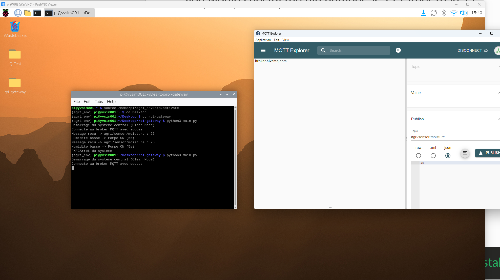
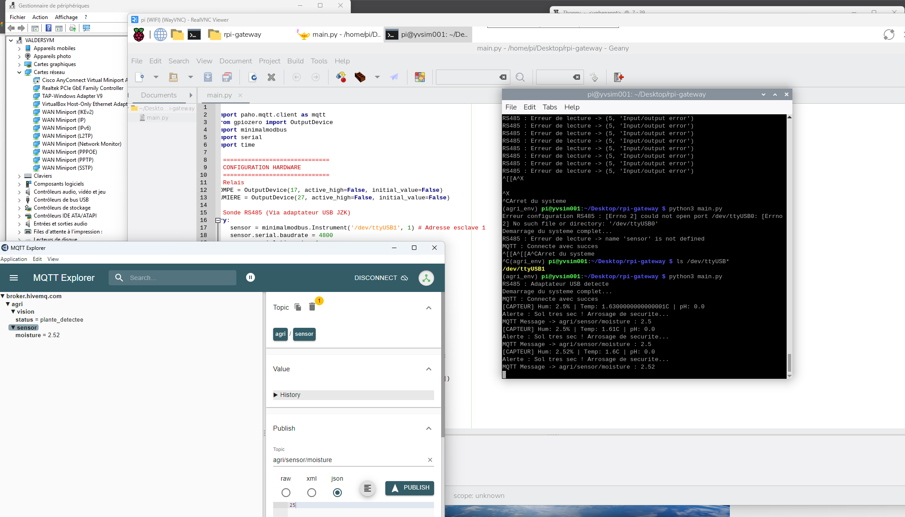

# 🌿 Smart Agri Embedded AI — Micro-Ferme Autonome

Système distribué de monitoring et d'automatisation agricole utilisant l'IA embarquée, le protocole MQTT et une architecture multi-cartes.

---

## 📸 Galerie & Démonstrations

### 🖥️ Monitoring & Logs (MQTT)
*Suivi des flux de données en temps réel via MQTT Explorer.*

|          MQTT Explorer - Détection         |          MQTT Explorer - Humidité         |
| :----------------------------------------: | :---------------------------------------: |
|  |  |
| *Statut des topics globaux*                | *Logs de la sonde d'humidité*             |

### 👁️ Inférence Vision IA (Tinker Board)
*Résultats de la détection de santé des plantes par l'IA.*

| Analyse Vision 1 | Analyse Vision 2 |
| :----------------------------------------------------------------------------: | :---: |
| .jpeg) |  |

---

### 📺 Vidéos de Démonstration

## 1️⃣ Activation des Relais (Contrôle MQTT)
[](./Bilder/MAH03529.MP4)

## 2️⃣ Test de fonctionnement du système
[](./Bilder/PXL_20260201_130745520.LS.mp4)

## 3️⃣ Overview de l'installation
[](./Bilder/PXL_20260201_130806733.LS.mp4)


### 🖼️ Photos du Projet

|            Configuration Hardware       |            Dashboard Mobile            |
| --------------------------------------- | -------------------------------------- |
| *Raspberry Pi + Tinker Board + Arduino* | *Interface de contrôle IoT MQTT Panel* |

---

## 🏗️ Architecture du Système

Le projet repose sur une communication **MQTT** (Message Queuing Telemetry Transport) où chaque carte joue un rôle spécifique :

* **Raspberry Pi 4B (8GB) :** Le **Gateway Central**. Il héberge le broker MQTT, traite la logique métier et pilote les actuateurs (pompes, lumières) via ses ports GPIO.
* **ASUS Tinker Board 2 :** L'**Expert Vision**. Effectue l'inférence IA en temps réel (TFLite/YOLO) pour détecter les anomalies sur les plantes.
* **Arduino Nano 33 IoT :** Le **Capteur d'Environnement**. Mesure l'humidité, la température et envoie les données au Gateway.

---

## 📂 Structure du Répertoire

```bash
smart-agri-embedded/
├── README.md              # Documentation complète
├── Bilder/                # Photos et vidéos (assets)
│
├── rpi-gateway/           # LE CERVEAU (Raspberry Pi 4)
│   ├── main.py            # Orchestrateur (MQTT -> Relais)
│   ├── sensors_npk.py     # Lecture Sonde NPK (RS485)
│   ├── actuators.py       # Gestion des GPIO
│   └── requirements.txt   # Dépendances Python
│
├── tinker-vision/         # L'EXPERT VISION (Tinker Board 2)
│   ├── inference.py       # Script IA (TFLite)
│   ├── models/            # Fichiers modèles .tflite
│   └── camera_utils.py    # Gestion flux caméra CSI
│
└── nano-sensor/           # LE SCOUT (Arduino Nano 33 IoT)
    ├── sensor_node.ino    # Code Arduino
    └── config.h           # Paramètres WiFi et Topics

```

---

## 🛠️ Installation & Configuration

### 1. Préparation de l'environnement (RPi)

```bash
# Création de l'environnement virtuel
python3 -m venv agri_env
source agri_env/bin/activate

# Installation des dépendances
pip install paho-mqtt RPi.GPIO

```

### 2. Configuration MQTT

Le script est configuré pour se connecter à un broker local ou distant.

* **Port :** 1883
* **Encodage :** UTF-8 

---

## 📡 Matrice de Communication (Topics)

| Topic | Source | Action du Gateway |
| --- | --- | --- |
| `agri/sensor/moisture` | RPi    | Si < 5% : Active `Pompe ON` |
| `agri/vision/status`   | Tinker | Si `present` : Active `Plante detectee` |
| `agri/control/relay1`  | RPi    | relais pompe, lumiere |

---

## ⚠️ Notes Techniques & Troubleshooting

> **Encodage UTF-8 :** Suite à des erreurs `UnicodeDecodeError` rencontrées sous Thonny, tous les fichiers doivent être sauvegardés explicitement en **UTF-8 sans BOM** pour supporter les logs et commentaires.

* **Broker MQTT :** Si vous utilisez le PC comme broker, vérifiez que le pare-feu autorise le port 1883.
* **Relais :** Ne branchez pas les pompes directement sur les pins 5V du RPi (utilisez une alimentation externe).

---

## 🚀 Prochaines Étapes

* [ ] Stabiliser la connexion WiFi du module Nano 33.
* [ ] Intégrer la lecture RS485 pour la sonde NPK.
* [ ] Créer un dashboard de monitoring historique avec InfluxDB et Grafana.

---

**Projet réalisé dans le cadre du développement Smart Agri 2024. 🌿**

---